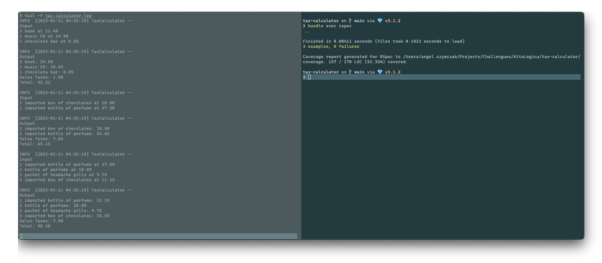

# Requirements

- ruby 3.1.2
- bundler 2.3.25

# Statement

Basic sales tax is applicable at a rate of 10% on all goods, except books,
food, and medical products that are exempt. Import duty is an
additional sales tax applicable on all imported goods at a rate of 5%,
with no exemptions.

When I purchase items I receive a receipt which lists the name of
all the items and their price (including tax), finishing with the
total cost of the items, and the total amounts of sales taxes paid.
The rounding rules for sales tax are that for a tax rate of n%,
a shelf price of p contains (np/100 rounded up to the nearest 0.05) amount of
sales tax.

# Run

After setup requirements and dependencies,
check the outputs for this program.

You, can tell the log file output by:

```bash
touch tax_calculator.log
tail -f tax_calculator.log
```

And then run the test suite by:
`bundle exec rspec`

# Expected output


